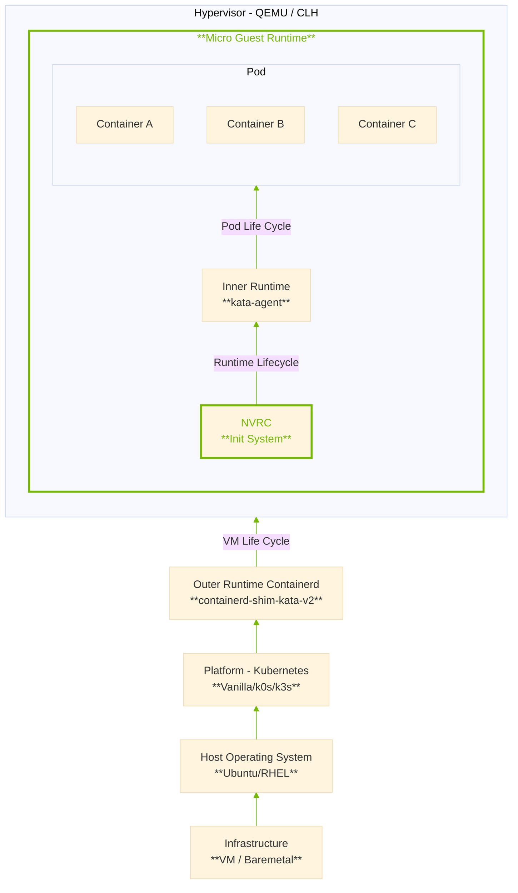
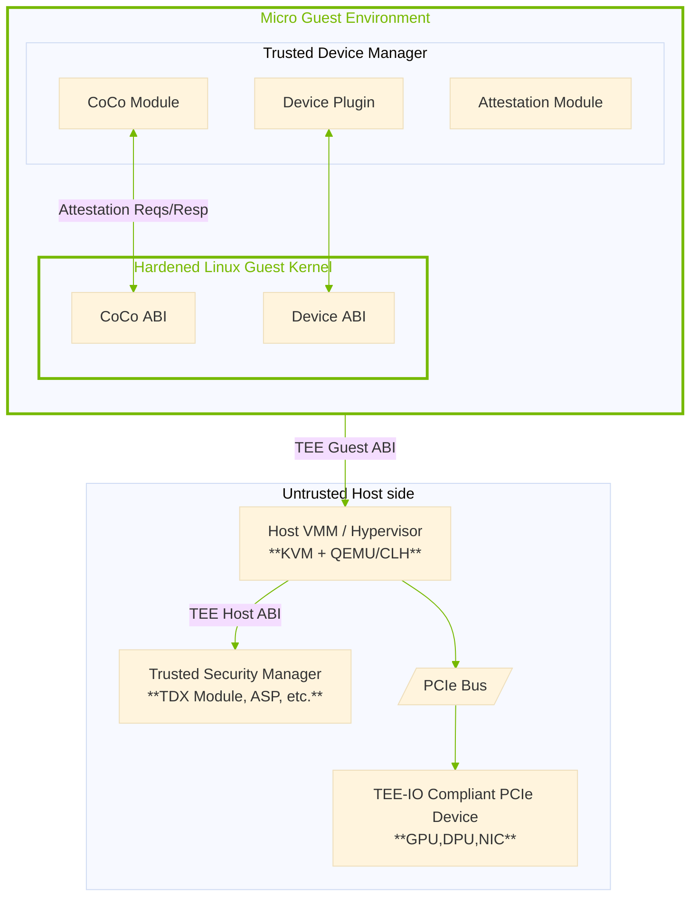

# Micro VM Guest Execution Environment for Confidential Containers

**Ensuring trust, minimizing overhead, and safeguarding AI workloads with
verified security**

## **Introduction and Motivation**

In the rapidly evolving landscape of container-based deployments, especially
those supporting high-value AI workloads, the demand for robust security and
efficient resource utilization has never been higher. Confidential Containers
offer an additional layer of isolation by operating containers inside
lightweight confidential virtual machines; however, even these solutions can
benefit from an execution environment that removes unnecessary components.
KVM/QEMU-based VMs, for example, share the same host kernel, meaning that a
successful breakout can lead to denial-of-service (DoS) attacks on the host,
potentially impacting other workloads, even if the VM is running inside a
Trusted Execution Environment (TEE). By replacing a traditional, large-scale
guest operating system with a formally verified, minimal guest environment, we
significantly lessen both the software footprint and the potential attack
surface. This method safeguards sensitive AI workloads and data while
maintaining the performance advantages crucial for modern, scalable
applications.

## **Background on Kata Containers and Micro VM Concepts**

Confidential Containers combine the security benefits of confidential virtual
machines with the flexibility and performance of containers by assigning each
Pod its own lightweight VM. While this architecture already enhances isolation,
further security and resource improvements can be achieved by minimizing the
underlying guest operating system. Micro VM architectures, exemplified by
technologies like Firecracker, eliminate unnecessary subsystems, retaining only
what is essential for containerized workloads. In the case of Confidential
Containers, this philosophy manifests as a minimal kernel configuration, where
only the core drivers, networking stack, memory management features, and system
calls directly relevant to the container life cycle remain enabled. By removing
extraneous modules, Confidential Containers reduce their potential attack
surface and strengthen the security boundary for critical containerized AI
workloads.

## **Formal Verification and Security Guarantees**

Formal verification is a methodical, mathematical process that establishes
software correctness, making it particularly valuable in environments requiring
high assurance. When this process is paired with Rust, a language renowned for
its strong memory safety guarantees and robust concurrency model, the micro VM
execution environment gains an even stronger security foundation. Rust
inherently mitigates common threats like buffer overflows and data races, while
formal verification of critical Rust-based components ensures they perform
exactly as specified. The result is a minimal init system whose correctness can
be mathematically validated, providing a higher degree of trust for confidential
AI workloads operating under Confidential Containers.

## **Threat Modeling and Attack Vectors**

We assume an adversary who controls container images, network input, and even
side-channel vantage points, but **does not control** the hardware root of
trust or DPU firmware. Several key mitigations:

| Attack class                       | Traditional guest exposure | Micro-guest countermeasure                                          |
| ---------------------------------- | -------------------------- | ------------------------------------------------------------------- |
| Userland rootkits                  | Full shell & compiler      | No package manager; fs-verity/IPE block unsigned binaries           |
| Kernel-mode rootkits               | LKM loading, eBPF abuse    | Signed-only modules, lockdown, LKRG runtime checks, no eBPF enabled |
| Privilege escalation via `setuid`  | Dozens of suid binaries    | SafeSetID LSM; no suid binaries shipped                             |

An attacker who breaches the container ends up in a **feature-limited
sandbox**: no shells, no compiler, a restricted list of syscalls, and likely
continuous integrity monitoring from the DPU (DOCA AppShield).

Lateral movement options diminish, and persistence involves overcoming multiple
independent controls, measured boot, IPE policy, LKRG, and remote attestation,
each of which provides forensics-friendly evidence.

Consequently, the next chapter examines in detail how modern rootkits operate,
conceal themselves, and persist, highlighting precisely which remaining attack
paths our layered defenses must block.

## **Rootkits: Functionality, Techniques, and Persistence**

Rootkits are advanced malicious tools that hide their presence and actions from
standard detection mechanisms. They can exist in both user and kernel spaces,
enabling attackers to alter how a system displays, logs, and manages its
internal processes. Rootkits support covert operations by intercepting or
manipulating essential system functions, from concealing files and directories
to maintaining persistent backdoors.

### **Core Functionalities**

* **Hiding Files, Directories, and In-Memory Structures:**
  A fundamental objective of many rootkits is to hide malicious artifacts by
  intercepting system calls (e.g., `sys_getdents`, `readdir`, `fopen`) or by
  patching in-memory structures. This stealth approach keeps suspicious files
  or directories invisible to typical user commands and system utilities.
* **Process Hiding:**
  Rootkits can replace standard tools like `ps` or intercept system calls
  (`sys_kill`, `find_task_by`, etc.) to mask the presence of running malicious
  processes. By removing corresponding entries in `/proc`, attackers avoid
  detection by system administrators.
* **Connection Hiding:**
  Network-based activities such as malicious connections or listening sockets
  may be hidden by tampering with tools like `ip` or by intercepting library
  calls (e.g., libpcap). Rootkits might also manipulate `/proc` entries or
  functions like `tcp_seq_show` and `fopen` to cloak network traces.
* **Backdoors and Command & Control:**
  Many rootkits implement triggers (e.g., hooking `sys_accept`) to spawn
  reverse shells or embed code that periodically connects to attacker-controlled
  servers. They can also tamper with authentication mechanisms, such as
  Pluggable Authentication Modules (PAM), to grant access to privileged or
  "pseudo" users undetected. For example, a PAM-based backdoor might: drop a
  rogue shared object into `lib/security` and modify `/etc/pam.d/…` so every
  SSH or login attempt loads attacker-controlled code.
* **Local Privilege Escalation:**
  Rootkits often run with elevated privileges for installation. Once active,
  they can grant further privileges to other processes (using `setuid`,
  `setgid`) or hook into additional system calls for broader system-level
  control.
* **Detection Evasion and Manipulation:**
  Advanced rootkits monitor the execution of detection tools (e.g., hooking
  the `execve` function) and can temporarily revert any malicious changes,
  reinserting them once scanning is finished. They may also manipulate logs
  and spoof process maps (e.g., `/proc/<pid>/maps`) to hide evidence of
  tampering.

### **User Space Rootkits**

Rootkits operating in user space typically alter application binaries or
intercept dynamic linking processes:

* **Application-Level Rootkits:**
  These replace or patch standard utilities, like shells or monitoring tools,
  to conceal malicious activity. Persistence can be achieved by overwriting
  binaries on disk, although integrity-focused measures such as dm-verity and
  fs-verity, or using a read-only root filesystem, can counter these attacks.
* **Dynamic Linker Rootkits:**
  By abusing `LD_PRELOAD` or modifying libraries used by the dynamic linker,
  attackers can intercept library calls across the system. Placing malicious
  libraries in `/etc/ld.so.preload` ensures the rootkit code loads before
  legitimate system libraries, granting pervasive control over system calls.

### **Kernel Space Rootkits**

Kernel space rootkits are particularly potent as they operate at a privileged
level with unrestricted access to the system:

* **Loadable Kernel Modules (LKMs) and eBPF:**
  Most kernel-mode rootkits begin as LKMs, which are loaded at runtime and can
  remove themselves from kernel data structures (`mod_list`, `mod_tree`,
  `mkobj`) to stay hidden. Alternatively, eBPF programs can be used to inject
  malicious functionality without a traditional kernel module. Persistent
  installation might involve placing entries in `/etc/modules`,
  `/etc/modules-load.d/`, or copying malicious files to the root filesystem.
* **System Calls and Interrupts:**
  Rootkits redirect execution flow to malicious handlers by replacing pointers
  in the system call table, entirely swapping out the system call table, or
  inserting jumps at the start of system calls. Techniques like trace hooks or
  eBPF-based hooks further expand the attacker's ability to intercept and
  manipulate low-level operations.
* **Virtual File System (VFS) Manipulation:**
  The VFS layer mediates file operations in the kernel. Rootkits can patch or
  hook these filesystem functions to hide files, directories, and modules, or
  generate pseudo-files that remain undetectable to ordinary inspection
  utilities.

### **Persistence Strategies**

Rootkits aim to survive reboots and other cleanup efforts:

* **Module Loading and Configuration Files:**
  Automated loading through entries in `/etc/modules` or system-wide loading
  scripts ensures the malicious code reloads on reboot.
* **Dynamic Linking Modifications:**
  Rootkits ensure their libraries remain in use by altering the dynamic
  linker's behavior, e.g., pointing it to a different `LD_PRELOAD` path, even
  if standard environment variables are cleared.
* **Kernel-Level Hiding:**
  Some rootkits directly manipulate in-memory data structures so that the
  underlying system remains compromised even after a reboot if the malicious
  code is not entirely eradicated from the kernel or boot process.

Rootkits pose an advanced and persistent threat by combining stealth tactics
with hooks into critical system components. Their capacity to remain hidden,
whether through user- or kernel-space modifications, allows attackers to
maintain long-term access, facilitate data exfiltration, or disrupt system
functionality. In a **minimal guest environment**, immutable rootfs, **no PAM
stack**, signed-only LKMs, and continuous integrity monitoring, many of these
tactics become far harder to deploy. Nevertheless, a robust combination of
verified kernel components, security policies, and constant monitoring (e.g.,
kernel toolkit detection) is essential to identify and neutralize rootkit
threats effectively.

## **Security Mechanisms and Countermeasures**

To neutralize the rootkit capabilities outlined in the previous section, the micro-VM
guest relies on a tightly layered hardening model. The measures below work in
concert to restrict code execution, constrain privilege, and expose tampering
attempts before damage can occur:

* **Minimal Userland** – Eliminates typical reconnaissance and lateral-movement
  tools.
* **Memory Isolation** – Keeps processes from inspecting or corrupting one
  another.
* **Sandboxing & Resource Controls** – Enforces strict quotas, preventing
  misbehaving tasks from exhausting shared resources.
* **Minimal Kernel Configuration** – Removes unused subsystems, cutting both
  attack surface and overhead.
* **Rust-Based Formal Verification** – Provides mathematical assurance for the
  minimal init and supporting libraries.
* **SELinux \+ Seccomp** – Couples mandatory-access controls with syscall
  allow-lists to block unauthorized actions.
* **Kernel Toolkit Detection** – Monitors in-memory state to catch hidden
  modules or privilege-escalation attempts.

The following sections examine each control, starting with the chiselled root file
system and the simplistic init system, and show how they deprive rootkits of
the hooks they need to install, hide, or persist.

### **Chiselled Root File System** — *done*

The Chiselled Root File System significantly enhances the security posture of
confidential container environments by strictly limiting the guest operating
system to only the essential binaries and libraries required at runtime. Built
upon an immutable and minimal file system design, it prevents attackers from
adding, modifying, or deleting critical system components after deployment. The
Chiselled Root File System provides a foundational guarantee against rootkits
and unauthorized system modifications by enforcing immutability and leveraging
formally verified minimal environments.

#### **Configuration Options** — *done*

The build system supports two main types, namely the Kata or Confidential
Containers chiselled root filesystem. Each type can be further divided into
additional functions that can be enabled or disabled depending on the use case.

```bash
# For all nvidia_gpu targets we can customize the stack that is enabled
# in the VM by setting the NVIDIA_GPU_STACK= environment variable
#
# latest | lts | version  -> use the latest and greatest driver,
#                            lts release or e.g. version=550.127.1
# driver                  -> enable open or closed drivers
# debug                   -> enable debugging support
# compute                 -> enable the compute GPU stack, includes utility
# graphics                -> enable the graphics GPU stack, includes compute
# dcgm                    -> enable the DCGM stack + DCGM exporter
# nvswitch                -> enable DGX like systems
# gpudirect               -> enable use-cases like GPUDirect RDMA, GPUDirect GDS
# dragonball              -> enable dragonball support
#
# The full stack can be enabled by setting all the options like:
#
# NVIDIA_GPU_STACK="latest,compute,dcgm,nvswitch,gpudirect"
```

### **NVRC - (NVIDIA runcom) simplistic init system** [#104](https://github.com/NVIDIA/nvrc/issues/104)

The minimal init system is the lightweight, formally verified entry point
responsible solely for initializing the runtime environment and launching the
Kata agent. Designed with simplicity in mind, it executes only essential tasks
required to enable the Kata agent's functionality, avoiding unnecessary
complexities or dependencies typical of traditional init processes. By
minimizing both its functionality and codebase, the minimal init system
significantly reduces the potential for security vulnerabilities, ensuring a
secure and efficient lifecycle management environment for confidential AI
containers.

The minimal init system incorporates several targeted features to securely and
efficiently bootstrap the Kata agent, including:

* Verification of **dm-verity** hash
* Any **userland panic** will result in a reboot of the VM, and consequently
  trigger a Pod/Container(s) restart
* **Randomly generated user-group(s)** used for starting services like
  nvidia-persistenced
* Remounting the root as **read-only**
* After loading the signed drivers, the kernel module loading is disabled
  **`/proc/sys/kernel/modules_disabled`**, and only a reboot can enable it
* The **CC mode** of all GPUs is checked, and if there is a mismatch, NVRC will
  panic and trigger a reboot
* Several **seccomp filters** are added so that a hijacked NVRC cannot execute
  additional system calls
* **NVRC** and other components are restricted via **cgroups** from consuming
  resources
* Unsetting `LD_PRELOAD` and readonly `/etc/ld.so.preload`

<!-- Diagram 1: Layered Kata architecture with NVRC and chiselled rootfs -->



### **Seccomp Secure Computing Mode** [#105](https://github.com/NVIDIA/nvrc/issues/105)

**Seccomp** allows the kernel to enforce a per-process *allow list* of system
calls, optionally gated by argument filters. Because a rootkit must invoke
calls such as `socket()`, `bind()`, `listen()`, `setsockopt()`, or
Netlink-specific operations to spin up a covert listener or rename an existing
socket, a tight seccomp profile can simply deny those primitives, or confine
them to specific address families and ports. If the container legitimately
needs only outbound TCP to a known service, for instance, the profile can drop
all raw-socket, packet-socket, and Netlink creation entirely; any attempt by
malicious code to create or disguise a listening socket will be aborted by the
kernel (returning `EPERM` or killing the task), eliminating the rootkit's
primary avenue for connection hiding.

### **SELinux** [#106](https://github.com/NVIDIA/nvrc/issues/106)

SELinux provides mandatory access control policies that strictly separate the
container context from the host context, effectively limiting interactions
between the containerized workload and the underlying infrastructure. By
enforcing well-defined security boundaries, SELinux ensures that attackers
cannot escalate privileges or manipulate the host environment, even in the
event of a compromise. With the minimal init system and Chiselled Root File
System, which prevent runtime modifications and additions, SELinux further
guarantees that container images cannot serve as payloads for introducing
unauthorized binaries or tools into the guest environment. This layered defense
significantly reduces potential attack vectors, reinforcing the integrity and
confidentiality of AI workloads.

Reference: [https://github.com/kata-containers/kata-containers/pull/11742](https://github.com/kata-containers/kata-containers/pull/11742)

### **Kernel Module Signing** — *done*

Kernel module signing in Kata Containers enhances security by enforcing strict
module authenticity through signature verification. The `CONFIG_MODULE_SIG_FORCE`
option is enabled, ensuring only modules signed with a valid cryptographic key
can load into the kernel.

Kata's monthly release process incorporates a unique rotating-key strategy:
with every build, a new random key pair is generated specifically for signing
kernel modules. Immediately after modules are signed, the private key is
securely discarded, effectively preventing future unauthorized use. This
rigorous, per-release key rotation scheme significantly mitigates risks
associated with compromised keys, malicious modules, and kernel-level
persistence attacks.

This mechanism is also activated with each PR, meaning that every build of the
Kernel and/or Rootfs will trigger the creation of a new rotating key.

### **Kernel Hardening** [#107](https://github.com/NVIDIA/nvrc/issues/107)

To raise the bar against kernel-level exploits, the micro-VM guest enables a
focused set of Linux Security Modules (LSMs) that operate even before user
space starts. `loadpin` ensures that every file the kernel loads (including
firmware and modules) comes from the immutable, trusted root file system;
`safesetid` blocks unauthorized UID/GID changes that could otherwise grant
privileges; and the kernel-wide `lockdown` mode closes off direct hardware
access, raw memory writes, and other interfaces that attackers commonly abuse.
Together, these LSMs make it far harder for a compromised container or
malicious module to tamper with the kernel or escape its confinement,
reinforcing the guarantees already provided by the minimal init system and
chiselled rootfs. Additional LSM would be `Yama`, reducing introspection
vectors that advanced malware often leverages.

Further kernel hardening options are, e.g.

| Kernel build-time hardening | CFI / KCFI (`CONFIG_CFI_CLANG`) RANDSTRUCT and STACKLEAK | Blocks control-flow hijacks inside the *remaining* kernel code; negligible runtime cost when compiled with Clang/LLVM. |
| :-------------------------- | :------------------------------------------------------- | :--------------------------------------------------------------------------------------------------------------------- |
|                             | **`CONFIG_INIT_ON_ALLOC` and `CONFIG_INIT_ON_FREE`**     | Zeroes every page on allocation/free, preventing information leaks if an attacker does gain arbitrary-read primitives. |
|                             | **`STRICT_MODULE_RWX` \+ `rodata=on`**                   | Forces module text read-only/exec-only and kernel read-only data permanent, thwarting live patching attempts.          |

### **Integrity Policy Enforcement (IPE)** [#108](https://github.com/NVIDIA/nvrc/issues/108)

Integrity Policy Enforcement is a modern Linux security module that takes code
integrity one step beyond traditional access control. Rather than looking at
file paths or labels, IPE bases every decision on *immutable security
properties*, for example, whether the file resides on a dm-verity-protected,
read-only root or whether its fs-verity hash matches a trusted digest. When a
process attempts to `execve`, `mmap PROT_EXEC`, or otherwise consume code, IPE
checks that the target file's integrity has been cryptographically validated
against the policy; if not, the operation is denied before any user-space
instructions run.

In the micro-VM guest, enabling IPE with a tight policy that whitelists only
the chiselled rootfs (and the minimal, read-only overlay used for container
layers) provides an additional guardrail: even if an attacker were somehow able
to copy a rogue binary into the guest file system, that binary could never be
executed or *mmap*'d as code because it would fail IPE's integrity checks.
Combined with LoadPin, SafeSetID, Lockdown, and the rotating key–signed kernel
modules, IPE completes the defense-in-depth story, ensuring that every
executable bit in the confidential AI workload is both *origin-verified* and
*policy-approved* before it ever reaches the CPU.

### **Measured Rootfs** [#109](https://github.com/NVIDIA/nvrc/issues/109)

The guest’s root is *measured* in two complementary layers:

* **dm-verity** protects the entire read-only root block device. At boot, the
  kernel (via `veritysetup`) validates the *root hash* of the on-disk Merkle
  tree before the device is mounted, anchoring the chain of trust. Afterward,
  each 4 KiB block is re-checked against its hash whenever it is fetched, but
  the heavy-weight verification of the tree itself happens only during that
  initial device-mapper setup, keeping early-boot latency low
* **fs-verity** adds file-level integrity to the writable upper layers (e.g.,
  model weights or updated binaries). Every protected file carries its own
  Merkle tree; when a page of the file is *paged-in* or `mmap`'d, the kernel
  verifies that page up the tree to the stored root hash *before* the folio is
  marked up-to-date in the page-cache. This on-demand check means you pay the
  cryptographic cost only for touched data; individual files can be added or
  replaced without rebuilding an entire block-level tree.

Because `fs-verity` exposes each file's root digest to VFS, the **Integrity
Policy Enforcement (IPE)** LSM can whitelist exactly those digests allowed to
execute or `mmap PROT_EXEC`. The result is a tight feedback loop: dm-verity
guarantees the immutability of the base image, fs-verity guarantees the
authenticity of new or mutable files, and IPE enforces that only measured,
policy-approved code ever reaches the CPU, delivering continuous, verifiable
integrity from boot through runtime.

### **Linux Kernel Runtime Guard (LKRG)** [#110](https://github.com/NVIDIA/nvrc/issues/110)

Linux Kernel Runtime Guard is a self-protecting kernel module that continuously
monitors the kernel's internal state for unexpected changes and enforces
integrity at run time. It keeps hashed "golden" copies of critical code pages,
kernel structures, and process credentials; if tampering (e.g., illicit
`ptrace`, privilege-escalation, or ROP gadgets injected into kernel text) is
detected, LKRG can immediately kill the offending task or trigger a panic.
Within the micro-VM guest, LKRG complements the *static* defenses provided by
dm-verity, fs-verity, IPE, and signed-only modules by adding an active,
in-memory watchdog: even if an attacker bypassed earlier integrity checks and
achieved code execution in kernel space, LKRG would spot the anomaly and shut
it down before persistence or further escalation is possible. Because the
module is baked into the chiselled rootfs and signed by the per-build rotating
key, it loads automatically at boot and operates with negligible overhead,
rounding out the defense-in-depth chain from measured boot, through
policy-enforced execution, to continuous kernel integrity monitoring.

### **VM Introspection, DOCA AppShield** [#111](https://github.com/NVIDIA/nvrc/issues/111)

DOCA AppShield offloads intrusion detection to the BlueField DPU. The DPU
exposes a **DMA engine** that can read guest or host memory directly,
reconstruct live artifacts (such as process lists, loaded modules, and network
connections), and run detection heuristics entirely *outside* the VM's trust
domain. Because nothing is installed inside the guest, an attacker who
compromises the workload cannot tamper with the sensor, and the analysis path
imposes virtually no overhead on the AI application itself. This out-of-band
vantage makes AppShield effective against kernel-level rootkits,
privilege-escalation chains, and unknown (zero-day) exploits.

Kata Containers can already leverage AppShield by passing a NIC virtual
function (VF) or vDPA endpoint through to the micro-VM, so the DPU's DMA engine
can reach guest memory. Extending the same protection to full **Confidential
Containers** is in progress: the DMA engine will not work in a TEE because DMAs
are a highly untrusted operation and can break memory-encryption guarantees.
Ongoing work explores (i) bounce-buffered devices that expose telemetry
buffers, and (ii) an attested side-channel that allows, for example, a
coconut-svsm agent running at a privileged VM privilege level to push memory
snapshots to the DPU over a secure virtio queue. Once these mitigations are
implemented, DOCA AppShield will provide the same deep-runtime visibility and
forensics for confidential AI workloads, without compromising the VM's
isolation boundary.

### **Two Operating Modes for Observability**

#### Baseline "Full-CC" Mode (no infrastructure trust)

* The default deployment of the micro-VM.
* The TEE encrypts RAM and blocks all direct DMA; host software, including
  BlueField firmware, cannot read guest memory.
* Observability is limited to what the guest deliberately emits (e.g., LKRG
  alerts, periodic fs-verity/SBOM reports, enabled logs) and what the hardware
  attestation quote proves.
* Isolation guarantees align with the classic Confidential-Container promise:
  the cloud operator learns nothing about the in-guest state unless the tenant
  chooses to reveal it.

#### Optional "Introspection-Enhanced" Mode (AppShield opt-in)

* The tenant explicitly grants the BlueField DPU a narrow, audited pathway to
  memory snapshots, either via a bounce-buffered virtio device or an attested
  side channel from a helper VM such as coconut-svsm.
* DOCA AppShield can then reconstruct process lists, loaded modules, and
  network endpoints in real time, applying out-of-band heuristics for rootkit
  or privilege-escalation detection.
* This increases visibility for SecOps and forensics but weakens the strict
  "no infrastructure trust" stance: the tenant must now trust the DPU firmware
  (and the mediation layer) not to exfiltrate data beyond the agreed snapshot
  scope.

#### Trade-off in plain terms

| Dimension              | Full-CC mode                                                             | Introspection-Enhanced mode                                                                                            |
| :--------------------- | :----------------------------------------------------------------------- | :--------------------------------------------------------------------------------------------------------------------- |
| **Isolation boundary** | Guest memory never leaves the encrypted envelope.                        | Small, controlled leak: selected pages reach the DPU through a mediated path.                                          |
| **Detection depth**    | In-guest sensors only; host sees health beacons, not raw state.          | Host-side analytics see kernel structures and syscall patterns, useful for zero-day triage.                            |
| **Trust assumptions**  | Hardware TEE and the guest kernel are the only trusted computing base.   | Adds DPU firmware (and bounce-buffer service) to the TCB.                                                              |
| **Regulatory posture** | Maximum tenant secrecy; may satisfy "no infrastructure access" mandates. | Better runtime telemetry; may satisfy SOC 2 / FedRAMP incident-response requirements if the extra trust is acceptable. |

#### Guidance

Use **Full-CC** for highly regulated, secrecy-first workloads where any
host-side glimpse of memory is disallowed.

Enable **Introspection-Enhanced** only if your risk model values deep, real-time
forensics more than the marginal decrease in isolation, and ensure the DPU
firmware and mediation layer are themselves measured and attested (they can be
logged to a ledger and included in the attestation evidence bundle).

### **Guest File System Software Bill of Materials (SBOM) Enforcement** [#112](https://github.com/NVIDIA/nvrc/issues/112)

For every build of the chiselled root file system, we emit a file-based SBOM,
recorded in, for example, SPDX-JSON and bundled alongside the image hash, that
enumerates every binary, library, and configuration file present at release
time. At first boot, the minimal init validates this SBOM against the mounted
fs-verity digests, establishing a cryptographic baseline. A lightweight audit
service then replays the same check at a configurable interval (or upon
attestation request), flagging any file whose path, size, or hash is absent
from the signed SBOM. Because the rootfs is otherwise immutable, even a single
stray byte indicates tampering or unexpected package injection, providing
operators with an immediate, machine-readable signal that the guest integrity
has been violated.

### **Lift-and-Shift Compatibility**

Despite its aggressively stripped-down design, the chiselled runtime remains
completely **workload-agnostic**. Under Kata, the container never interacts
with the guest userland; it interacts solely with the familiar OCI interfaces
(stdin/stdout, `/proc`, `/dev`, mounts) provided by the Kata agent and virtio.
As a result, any Linux container image, whether a tiny scratch build or a
multi-gigabyte AI stack, can be "lifted and shifted" into this micro-VM without
modification. GPU and other passthrough devices connect through the same virtio
abstractions that the container already expects, so application code remains
unaware that it is running atop a formally verified, minimal OS. This maintains
the friction-free developer experience of containers while silently delivering
the hardened, measured environment detailed throughout the "Security Mechanisms
and Countermeasures" section.

### **Trusted Device Manager (TDM) for TDISP/IDE** [#113](https://github.com/NVIDIA/nvrc/issues/113)

Specific accelerators, GPUs, SmartNICs, PCIe 5.0/CXL devices, ship with
**TDISP / IDE** (Integrity & Data-Encryption) support so that all on-the-wire
traffic is cryptographically protected. A small, **Trusted Device Manager**
inside the micro-VM coordinates the protocol's *state machine*: it discovers
the device, receives attested IDE capabilities, provisions session keys,
monitors link health, and tears everything down during shutdown or migration.
Because the chiselled guest contains only the Rust-based init, the Kata agent,
and this TDM process in addition to the guest-components required for CC, no
extraneous binaries can interfere with, or impersonate, the state machine.
Coupled with dm-verity-backed immutability and SELinux confinement, the TDM
becomes a single, auditable control point that enforces device security without
inflating the attack surface.

<!-- Diagram 2: Trusted Device Manager - TDISP/IDE -->



The **Trusted Device Manager** is the only process permitted to transition the
device between these states; any attempt by malicious code to issue IDE
commands is blocked by seccomp filters and SELinux, and tampering with the TDM
binary itself would fail fs-verity and SBOM checks. Thus, the minimalistic VM
runtime not only keeps the state machine small and verifiable, but it also
guarantees that the cryptographic protection offered by TDISP/IDE remains
intact for the entire life cycle of the confidential workload.

### **Provenance & Supply-Chain Security** [#114](https://github.com/NVIDIA/nvrc/issues/114)

Every artifact that lands in the micro-VM, the kernel, signed LKMs, chiselled
rootfs image, SBOM, seccomp profile, LKRG policy, and Trusted-Device-Manager
binary, is produced by a **hermetic, reproducible build pipeline** and
immediately recorded in the **sigstore** transparency framework.

1. **Cosign signature** – At the end of each build job, Cosign signs the
   artifact with an *ephemeral key* backed by Sigstore's keyless Fulcio CA.
2. **Rekor entry**, The signature, artifact hash, build metadata (Git commit,
   SLSA provenance), and Fulcio certificate are inserted into the **Rekor
   ledger**, creating an immutable, tamper-evident log record.
3. **Golden reference set** – Digest values from the Rekor entries are copied
   into an *attestation manifest* that accompanies the release:

   * **dm-verity** root hash for the block image
   * **fs-verity** root digests for every executable in the rootfs
   * RSA public key for that build's one-time LKM-signing key
   * SHA-256 digest of the SPDX SBOM
   * SHA-256 digests of the TDM and Rust-init binaries
4. **Reproducibility proof**: Anyone can take the public source tree, rebuild
   it in the same containerised environment, and reproduce the exact byte-wise
   hashes that appear in Rekor, closing the supply-chain loop.

This process yields a **single source of truth**, a cryptographically
verifiable ledger entry, for every piece of software that will ever execute in
the confidential guest.

### **Attestation & Runtime Integrity** [#115](https://github.com/NVIDIA/nvrc/issues/115)

At launch, **NVRC**  **(NVIDIA runcom)** assembles an **evidence bundle** that
fuses hardware, software, and supply-chain claims:

* The **TEE quote** containing CPU-specific measurements (TDX report, SNP
  report, or Nitro attestation).
* **dm-verity root hash** captured by the early-boot firmware.
* **fs-verity** file digests are exported via IPE for all executable pages.
* **Cosign/Rekor inclusion proofs** for the kernel, rootfs, SBOM, and LKMs.
* **LKRG state vector** showing that kernel text and critical structures match
  the golden hashes.
* **TDM state** (current IDE keys and device attestation evidence).

A remote verifier retrieves the corresponding Rekor entries, checks the
inclusion proofs, and confirms that every digest in the TEE quote or IPE report
matches the golden references logged at build time. If all values align, the
workload is deemed **authentic and unmodified**.

Integrity assurance does not end at boot. Three lightweight monitors keep the
evidence fresh:

1. **SBOM auditor** replays the fs-verity comparison on a schedule (e.g., every
   hour) and raises an event if any file appears that is not in the signed
   SBOM.
2. **LKRG** continuously hashes live kernel text and key data structures;
   deviation triggers a kernel panic or guest-shutdown signal to the
   orchestrator.
3. **TDM watchdog** periodically revalidates the IDE session and device
   certificates, reporting anomalies through the attestation channel.

Each periodic report is again signed with the guest's attestation key and can
be matched against Rekor's immutable digests, giving operators **ongoing,
real-time proof** that the guest remains in the same trustworthy state it had
at first boot. In this way, provenance and attestation form an
unbroken chain: build-time transparency creates the reference values, and
run-time attestation continually proves that those values still govern the
executing system.

### **Attesting PCIe Topology and ACPI Tables in Confidential VMs** [#116](https://github.com/NVIDIA/nvrc/issues/116)

In Confidential Computing (CC) environments like those enabled by Kata
Containers, the VMM and firmware stack are not inherently trusted. When PCI
passthrough is used, especially for GPUs in AI workloads, it is crucial to
verify not only the presence of devices but also their position in the PCIe
topology. An incorrect topology can cause performance issues, unexpected side
effects (such as incorrect NUMA alignment), or even security vulnerabilities
through device spoofing or compromised ACPI methods.

When utilizing bounce-buffer mechanisms (for example, due to non-IDE GPU
passthrough), verifying **the ACPI tables and PCIe layout** becomes essential,
as these are the only guest-visible artifacts that describe the platform. This
chapter explains how to validate and attest to this information as part of the
minimal VM image for confidential environments.

### **Bounce-Buffer Scenario — Attesting ACPI Tables and PCIe Topology**

### **Why PCIe Topology Matters**

* **NUMA awareness**: The physical placement of a PCIe device affects memory
  locality and I/O throughput. Mismatches here degrade performance.
* **Device capabilities**: PCIe switches, root ports, and bridges may impose
  limitations (e.g., support for atomic ops, ATS, ACS).
* **Security boundaries**: Trust boundaries are tightly linked to the physical
  hierarchy. The VMM could fake a GPU placed behind a virtual bridge.

In Kata, you can influence PCIe topology per Pod by selecting where to attach
the GPU (e.g., directly behind a root port or behind a switch). This must be
**verifiably** **enforced** inside the guest.

### **Threat Model**

* **Untrusted host/VMM**
* **Malicious or manipulated ACPI tables**
* **Incorrect PCI topology leading to performance or isolation violations**
* **Invisibility of backdoored or injected devices**
* **Runtime AML injection attacks via SSDT hotplug, reloading, or memory
  remapping.**

### **What to Attest**

1. **PCIe Topology as Seen in the Guest**
   * Enumerate devices from `/sys/bus/pci/devices` and correlate with
     `lspci -tv` output.
   * Capture PCIe path (domain, bus, slot, function).
   * Validate expected layout: Root Port → Switch → GPU vs Root Port → GPU.
2. **ACPI Table Integrity**
   * Capture and hash critical ACPI tables:
     * DSDT, SSDT, FACP, MCFG, HPET, SRAT
   * Store known-good measurements (golden reference) per deployment profile.
   * Extend into attestation quote (either through bootloader extension or
     early-boot agent).
3. **NUMA Consistency**
   * Validate that the PCI device's reported NUMA node aligns with the guest
     memory topology (`/sys/devices/system/node` and `/proc/zoneinfo`).
4. **Bounce Buffer Awareness**
   * If bounce buffers are used (e.g., untrusted DMA), verify the IOMMU group
     mapping and enforce strict page ownership inside the guest kernel.
5. **Mitigate AML Injection**
   * Lock ACPI memory regions as read-only using page permissions or SNP/TDX
     protections.
   * Disable ACPI runtime table loading (`LoadTable`, hotplug-injected SSDTs).
   * Monitor AML namespace changes and disallow dynamic redefinition of AML
     methods.
   * Restrict or validate ACPI method invocation paths within the OS ACPI
     interpreter.

### **TDISP/IDE Scenario — Attesting PCIe Topology Only (With Hardened AML Runtime)**

With TDISP/IDE (Intel Device Extensions for TDX), devices present a secure and
verified interface directly to the guest. ACPI tables are no longer needed for
trusted configuration or enumeration. However, the **PCIe topology still
matters** and must be verified for accuracy and expected performance.

Importantly, **AML injection attacks are still possible even in TDISP/IDE
setups**. A malicious VMM can still:

* Inject new SSDTs post-boot using device hotplug interfaces.
* Map new ACPI tables into guest-visible memory.
* Cause re-evaluation of newly inserted AML methods that override or supplement
  existing logic.

These mechanisms allow attackers to trigger unsafe device configuration, memory
sharing, or even resource mapping under the guise of legitimate platform
reconfiguration.

### **What to Drop**

* No need to hash or verify ACPI tables for device trust enforcement.
* Skip parsing `_DSM`, `_OSC`, DSDT, SSDT for initial trust decisions.

### **What to Keep**

* **Enumerate PCIe topology from inside the guest**, precisely as in bounce
  buffer mode.
* Ensure the device is behind the expected Root Port, switch, or PCI domain.
* Ensure NUMA node affinity matches the expected config.

### **What to Add**

* **Block ACPI table updates post-boot** by disabling runtime ACPI table loader
  code paths.
* **Detect AML namespace additions or modifications** via kernel-integrated
  ACPI interpreter audits.
* Enforce that any AML method invocations conform to expected call graphs and
  do not affect memory ownership, DMA setup, or device state changes.

Even in TDISP environments, AML-based attacks (e.g., via `_DSM` hijacking, AML
redefinition, or SSDT injection) **remain active vectors** unless neutralized
at runtime.

When TDISP/IDE becomes widely available:

* Direct device attestation can replace reliance on ACPI tables for device
  discovery.
* However, ACPI spoofing and AML injection will remain a threat unless ACPI
  runtime execution is strictly controlled and monitored.
* This chapter will then focus on the hybrid mode, where IDE-capable and legacy
  devices coexist with layered protections.

Until then, **attesting the ACPI \+ PCIe layout is a mandatory part of ensuring
CC trust** in bounce-buffered passthrough environments, and **AML execution
paths must be hardened even under TDISP**.

### **Executable Compression with UPX** — *done*

To further reduce the size of the chiselled root filesystem, we compile and
then **pack all ELF binaries** **and shared libraries using UPX (Ultimate
Packer for eXecutables)**. UPX adds a small, position-independent stub at the
beginning of each file; during `execve`, the stub allocates memory,
transparently decompresses the payload, and then transfers control to the
original entry point. Since the compressed image, not the expanded text, is
stored on disk, this offers three advantages:

**Smaller immutable footprint.** The rootfs size decreases by 30-50%, lowering
TEE-encrypted pages, cold-boot I/O, and dm-verity hash-tree depth without
altering functional code.

**Integrity preserved.** fs-verity and the SBOM record the hash of the *packed*
file, so verification succeeds before execution; the in-memory text is then
protected by LKRG and CFI, like any other code page.

**Supply-chain continuity.** The Cosign/Rekor entry records both the original
build hash and the post-UPX hash, allowing rebuilders to reproduce either
artifact and still verify ledger inclusion.

Decompression adds only microseconds per process startup, negligible compared
to GPU initialization, and the UPX stub itself is statically analyzed and
covered by the same formal-verification linting we apply to the Rust init.
Thus, executable packing reduces every VM image we ship while remaining fully
compatible with the measured-boot, SBOM, and attestation flow described
earlier in this document.

### **Side-Channel Mitigations Using LSM and System Hardening** [#117](https://github.com/NVIDIA/nvrc/issues/117)

While TEEs help reduce observability, side-channel attacks can still exploit
kernel or user-space telemetry to infer sensitive workload behavior.
Specifically, Linux exposes high-resolution system data through performance
counters, scheduling statistics, timing interfaces, and device-level telemetry.
These sources can be misused to gather detailed information about control flow,
memory access patterns, or execution timing, potentially compromising the
confidentiality guarantees of the environment.

This section explains how to reduce or eliminate such exposure using Linux
Security Modules (LSMs), syscall filtering, mount restrictions, and kernel
configuration.

#### **Linux Interfaces Exposing Side-Channel-Relevant Telemetry**

A variety of standard Linux interfaces may leak execution behavior, including:

* `/proc/stat`, `/proc/[pid]/sched`, `/proc/self/status` – scheduler and
  per-thread execution stats
* `/sys/devices/system/cpu/`, `/sys/class/thermal/`, `/sys/class/powercap/` –
  hardware telemetry
* `/dev/perf`, `/dev/cpu/*/msr`, `/dev/kvm` – access to hardware counters or
  timing sources
* Syscalls such as `perf_event_open`, `ptrace`, `kexec_load`, and `rdtsc`
  (via inline assembly)

These interfaces should be disabled or filtered to reduce the observability of
confidential workloads.

#### **Filesystem and Mount-Based Restrictions**

Restricting virtual filesystems and device nodes can eliminate access to
telemetry sources:

* `/proc` should be mounted with `hidepid=2`, or omitted entirely when not
  needed.
* `/sys` should be mounted read-only or wholly excluded from the rootfs.
* `/dev` should omit nodes such as `/dev/perf`, `/dev/mem`, `/dev/cpu/*/msr`,
  and `/dev/kvm`.

In addition, kernel parameters should be set to reduce system-level visibility:

```text
/proc/sys/kernel/perf_event_paranoid = 3
/proc/sys/kernel/yama/ptrace_scope = 3
/proc/sys/kernel/kptr_restrict = 1
/proc/sys/kernel/dmesg_restrict = 1
```

These settings disable perf counter access, restrict ptrace, and hide kernel internals.

#### **Use of LSMs to Restrict Access**

Multiple Linux Security Modules can further limit observability:

* **Yama** restricts `ptrace` to self and direct descendants.
* **AppArmor** and **SELinux** can be configured to deny access to telemetry
  paths such as `/proc/*/sched` or `/dev/perf`, and to block execution of the
  `perf_event_open` syscall.
* **Landlock** allows unprivileged, per-process file access policies to prevent
  reading from side-channel-relevant filesystems.

Yama is lightweight and enabled with a single kernel option
(`CONFIG_SECURITY_YAMA=y`). AppArmor and SELinux require system-wide policy
configuration, while Landlock and BPF-LSM provide flexible enforcement for
constrained workloads.

#### **Complementary Filtering via seccomp**

Syscall filtering using seccomp-bpf can block side-channel-relevant system
calls such as:

* `perf_event_open`
* `ptrace`
* `kexec_load`
* `ioctl` on perf- or timing-related FDs
* `arch_prctl` with high-resolution timer features

Workload runtimes like Kata Containers support seccomp profiles and can load a
hardened syscall filter at container launch.

#### **Kernel Configuration**

For deployments requiring minimal telemetry exposure, kernel features can be
removed at build time:

```text
CONFIG_PERF_EVENTS=n
CONFIG_DEBUG_FS=n
CONFIG_KPROBES=n
CONFIG_BPF_SYSCALL=n
CONFIG_PROFILING=n
```

Removing these interfaces at compile time eliminates perf, debug, and tracing
subsystems entirely, reducing attack surface and improving assurance.

Side-channel resistance involves more than just memory encryption or encrypted
I/O. It requires removing or disabling timing sources, telemetry interfaces,
and diagnostic subsystems to eliminate covert channels and observability. Using
a combination of filesystem hardening, syscall filtering, kernel configuration,
and LSM-based access control creates minimal Linux environments with less
side-channel risk, ideal for sensitive workloads.

Reference: [https://www.ndss-symposium.org/ndss-paper/counterseveillance-performance-counter-attacks-on-amd-sev-snp/](https://www.ndss-symposium.org/ndss-paper/counterseveillance-performance-counter-attacks-on-amd-sev-snp/)

### **libc-free Rust, musl-static, and `no_std`** [#118](https://github.com/NVIDIA/nvrc/issues/118)

For all in-guest control components (Rust init, Trusted Device Manager helpers,
small utilities) we remove the C runtime where feasible and **do not rely on
any libc** at all: we build with `#![no_std]`/`#![no_main]`, provide a tiny
`_start` entry, and issue Linux syscalls directly (with `panic=abort` and a
minimal allocator). When a component truly needs the standard library, we
**statically link against musl** instead of glibc. (musl supports dynamic
linking, but our choice here is static; therefore, no runtime dynamic loader,
no `LD_PRELOAD`, and no plugin paths.)

#### hardened_std — Security-Constrained Standard Library

NVRC uses **hardened_std**, a `#![no_std]` drop-in replacement for portions of
Rust's standard library, designed specifically for ephemeral VM init processes
where fail-fast semantics are mandatory.

**Design principles:**

* **Whitelist-only access:** File paths, binaries, and socket paths must appear
  in compile-time allow-lists. Attempts to access anything else return
  `PathNotAllowed` or `BinaryNotAllowed` errors immediately.
* **Static arguments only:** Command arguments require `&'static str` — no
  runtime-constructed strings — eliminating command-injection vectors from
  dynamic data.
* **Fresh filesystem assumption:** In an ephemeral VM, NVRC is PID 1 on a clean
  rootfs. If a path already exists when it shouldn't, that's an error, not
  something to silently overwrite. No `remove_file` fallback logic.
* **Bounded operations:** Write operations enforce `MAX_WRITE_SIZE` (20 bytes),
  path lengths are capped at 255 bytes, and argument counts are limited to 16
  — compile-time constants that prevent unbounded resource consumption.
* **Path traversal rejection:** All paths are validated against `..` traversal
  and `/./` obfuscation before any syscall.

**Covered APIs:**

| Module        | Functions                                                |
| ------------- | -------------------------------------------------------- |
| `fs`          | `write`, `read_to_string`, `create_dir_all`, `File`      |
| `process`     | `Command`, `Child`, `ExitStatus`, `Stdio`, `exit`        |
| `os::unix`    | `net::UnixStream`, `process::CommandExt`                 |
| `collections` | Bounded `HashMap` with compile-time capacity limits      |

The result is a minimal, auditable syscall surface: only the exact files and
binaries NVRC needs are reachable, and every operation has strict size and path
constraints enforced before touching the kernel.

#### Practical effects on the chiselled rootfs

* **No libc dependency (where `no_std` is used):** no CRT start files, no
  `libc.so`, no NSS modules, no locale/loader side paths—shrinking the ABI
  surface the guest exposes.
* **musl-static for the rest:** when `std` is required, the resulting ELF is a
  single, self-contained binary; no `ld-linux*`, no `libdl` at runtime.
* **Predictable syscall set:** direct syscalls give a tight, auditable
  footprint that maps cleanly to strict seccomp allow-lists.
* **Simpler integrity artifacts:** one file per tool (no shared objects) yields
  1:1 hashes in SBOM/Rekor and straightforward fs-verity coverage.
* **Deterministic startup:** custom `_start` eliminates runtime symbol
  resolution and loader variability.

Any component that genuinely needs glibc semantics or runtime plugins lives
**inside the container** (opaque to the guest via Kata), while the micro-guest
itself remains **libc-free where possible and musl-static elsewhere**,
preserving the minimal, verifiable execution base described throughout this
document.

## **Conclusion**

The architecture presented here blends three complementary principles, **formal
verification, extreme minimization, and layered runtime monitoring**, to create
a micro-VM guest that is measurably safer than a traditional confidential-VM
stack:

* **Formally verified, Rust-based components** (minimal init, key helper
  libraries) remove entire classes of memory and logic errors before the system
  ever boots.
* A **chiselled, measured rootfs**, protected by dm-verity at the block layer
  and fs-verity \+ IPE at the file layer, guarantees that only code whose
  integrity is cryptographically proven can execute.
* **Kernel-level safeguards**, module signing with per-build key rotation,
  LoadPin, SafeSetID, Lockdown, LKRG, and other stackable LSMs, harden the
  remaining attack surface.
* **Run-time visibility from DOCA AppShield** offers out-of-band introspection
  capable of catching zero-day exploits that slip past static defenses, all
  without burdening the AI workload.

Individually, each layer blocks a distinct exploit avenue; together, they form
a defense-in-depth posture where breaking one control still leaves an attacker
facing multiple orthogonal barriers. Equally important, the entire chain, from
measured boot through continuous kernel-integrity checks, can be attested to a
remote verifier, allowing cloud tenants to prove that their AI models and data
run only in a known-good environment.

The net result is a **high-assurance, low-overhead execution platform** that
makes confidential AI practical at scale:

* **Performance stays close to bare-metal** thanks to the micro-VM footprint
  and Rust efficiency.
* **Security scales with every release** via automated key rotation,
  policy-driven hardening, and an update path that never enlarges the
  trusted-computing base.
* **Trust is exportable**, operators can expose attestation evidence that
  regulators and customers can validate independently.

As confidential computing hardware matures, this architecture can absorb future
advances, such as finer-grained memory encryption, hardware-verified I/O
isolation, and richer LSM hooks, without architectural upheaval. In short, the
combination of Kata Containers and a formally verified micro-guest provides a
**forward-looking blueprint for trustworthy AI infrastructure**, ready for the
most demanding, regulated, and safety-critical workloads.
