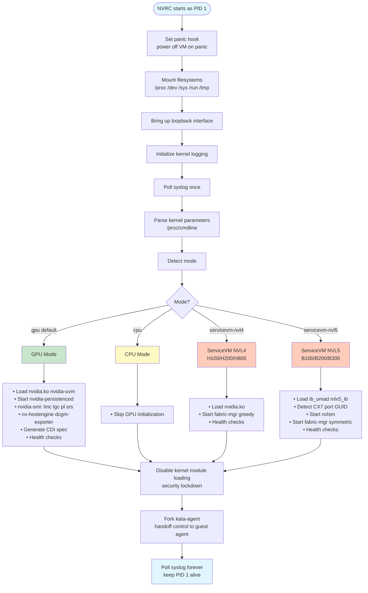

# NVRC - NVIDIA Runtime Container Init

[](https://scorecard.dev/viewer/?uri=github.com/NVIDIA/nvrc)

A minimal init system (PID 1) for ephemeral NVIDIA GPU-enabled VMs running
under Kata Containers. NVRC sets up GPU drivers, configures hardware, spawns
NVIDIA management daemons, and hands off to kata-agent for container
orchestration.

## Design Philosophy

**Fail Fast, Fail Hard**: NVRC is designed for ephemeral confidential VMs where
any configuration failure should immediately terminate the VM. There are no
recovery mechanisms—if GPU initialization fails, the VM powers off. This
"panic-on-failure" approach ensures:

- **Security**: No undefined states in confidential computing environments
- **Simplicity**: No complex error recovery logic to audit
- **Clarity**: If it's running, it's configured correctly

## Architecture



## Kernel Parameters

NVRC is configured entirely via kernel command-line parameters (no config
files). This is critical for minimal init environments where userspace
configuration doesn't exist yet.

### Core Parameters

| Parameter   | Values                                           | Default | Description                                                                                                                         |
| ----------- | ------------------------------------------------ | ------- | ----------------------------------------------------------------------------------------------------------------------------------- |
| `nvrc.mode` | `gpu`, `cpu`, `nvswitch-nvl4`, `nvswitch-nvl5`   | `gpu`   | Operation mode. `cpu` for CPU-only, `nvswitch-nvl4` for H100/H200/H800 service VMs, `nvswitch-nvl5` for B200/B300/B100 service VMs. |
| `nvrc.log`  | `off`, `error`, `warn`, `info`, `debug`, `trace` | `off`   | Log verbosity level. Also enables `/proc/sys/kernel/printk_devkmsg`.                                                                |

### GPU Configuration

| Parameter      | Values                 | Default | Description                                                                                        |
| -------------- | ---------------------- | ------- | -------------------------------------------------------------------------------------------------- |
| `nvrc.smi.lgc` | `<MHz>`                | -       | Lock GPU core clocks to fixed frequency. Eliminates thermal throttling for consistent performance. |
| `nvrc.smi.lmc` | `<MHz>`                | -       | Lock memory clocks to fixed frequency. Used alongside lgc for fully deterministic GPU behavior.    |
| `nvrc.smi.pl`  | `<Watts>`              | -       | Set GPU power limit. Lower values reduce heat/power; higher allows peak performance.               |
| `nvrc.smi.srs` | `enabled`, `disabled`  | -       | Secure Randomization Seed for GPU memory (passed to nvidia-smi).                                   |

### Daemon Control

| Parameter                   | Values                                  | Default  | Description                                                                                        |
| --------------------------- | --------------------------------------- | -------- | -------------------------------------------------------------------------------------------------- |
| `nvrc.uvm.persistence.mode` | `on/off`, `true/false`, `1/0`, `yes/no` | `true`   | UVM persistence mode keeps unified memory state across CUDA context teardowns.                     |
| `nvrc.dcgm`                 | `on/off`, `true/false`, `1/0`, `yes/no` | `false`  | Enable DCGM (Data Center GPU Manager) for telemetry and health monitoring.                         |
| `nvrc.fm.mode`              | `0`, `1`                                | -        | Fabric Manager mode: 0=bare metal, 1=servicevm (shared nvswitch). Auto-set in nvswitch modes.      |
| `nvrc.fm.rail.policy`       | `greedy`, `symmetric`                   | `greedy` | Partition rail policy. Symmetric required for Confidential Computing on Blackwell.                 |

### Example Configurations

**Minimal GPU setup (defaults):**

```text
nvrc.mode=gpu
```

**CPU-only mode:**

```text
nvrc.mode=cpu
```

**NVSwitch NVL4 mode (Service VM for HGX H100/H200/H800 - NVLink 4.0):**

```text
nvrc.mode=nvswitch-nvl4
```

**NVSwitch NVL5 mode (Service VM for HGX B200/B300/B100 - NVLink 5.0):**

```text
nvrc.mode=nvswitch-nvl5
```

**GPU with locked clocks for benchmarking:**

```text
nvrc.mode=gpu nvrc.smi.lgc=1500 nvrc.smi.lmc=5001 nvrc.smi.pl=300
```

**GPU with DCGM monitoring:**

```text
nvrc.mode=gpu nvrc.dcgm=on nvrc.log=info
```

**Multi-GPU with NVLink:**

```text
nvrc.mode=gpu nvrc.fm.mode=0 nvrc.log=debug
```

## Build

NVRC is compiled as a statically-linked musl binary for minimal dependencies:

```bash
# x86_64
cargo build --release --target x86_64-unknown-linux-musl

# aarch64
cargo build --release --target aarch64-unknown-linux-musl
```

Build configuration in `.cargo/config.toml` enables aggressive size
optimization and static linking.

## Testing

```bash
# Unit tests (requires root for some tests)
cargo test

# Coverage (requires llvm-cov and root)
cargo llvm-cov --all-features --workspace

# Fuzzing
cargo +nightly fuzz run kernel_params

# Static analysis
cargo clippy --all-features -- -D warnings
cargo audit
cargo deny check
```

## Security Model

NVRC operates with a defense-in-depth security model appropriate for
confidential computing:

1. **Minimal Attack Surface**: 7 direct dependencies, statically linked
2. **Fail-Fast**: Panic hook powers off VM on any panic (no undefined states)
3. **Read-Only Root**: Filesystem becomes read-only after initialization
4. **Module Lockdown**: Kernel module loading disabled after GPU setup
5. **OOM Protection**: kata-agent protected with OOM score adjustment (-997)
6. **Static Linking**: No dynamic library dependencies to compromise
7. **SLSA L3**: Build provenance and Sigstore artifact signing

### Why Panic Instead of Recover?

In traditional long-running systems, recovering from errors is valuable. In
ephemeral confidential VMs:

- **VM lifetime is seconds/minutes**: Restarting is faster than debugging
  partial failures
- **Confidential computing requires integrity**: Undefined states could leak
  secrets
- **Orchestrator handles retries**: Kubernetes/Kata will reschedule the pod
- **Simpler audit surface**: No complex recovery logic to verify

## Troubleshooting

### VM powers off immediately

Check kernel logs for panic messages. Common causes:

- Missing NVIDIA drivers in container image
- Invalid kernel parameters (check `/proc/cmdline`)
- Daemon startup failures (check logs with `nvrc.log=debug`)

### GPU not available in container

- Verify `nvrc.mode=gpu` (default, but check explicitly)
- Check that GPU is passed through to VM
- Ensure nvidia kernel modules are present
- Verify CDI spec generation succeeded

### DCGM/Fabric Manager not starting

- Enable debug logging: `nvrc.log=debug`
- Check that binaries exist in container image
- Verify configuration files are present (`/etc/dcgm-exporter/`, `/usr/share/nvidia/nvswitch/`)

## Contributing

See [CONTRIBUTING.md](CONTRIBUTING.md) for DCO sign-off requirements.

## Verification

See [VERIFY.md](VERIFY.md) for instructions on verifying release artifacts
with Sigstore.

## License

Apache-2.0 - Copyright (c) NVIDIA CORPORATION
