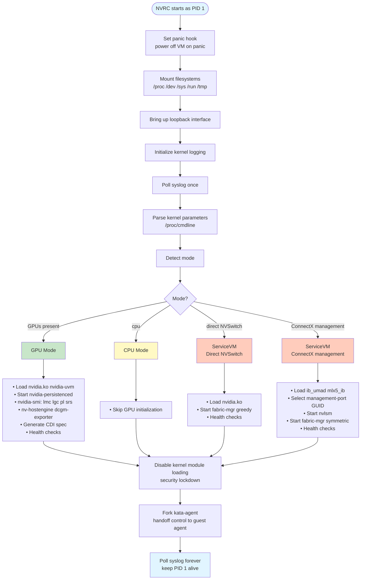

# NVRC - NVIDIA Runtime Container Init

[](https://scorecard.dev/viewer/?uri=github.com/NVIDIA/nvrc)

A minimal init system (PID 1) for ephemeral NVIDIA GPU-enabled VMs running
under Kata Containers. NVRC sets up GPU drivers, configures hardware, spawns
NVIDIA management daemons, and hands off to kata-agent for container
orchestration.

## Design Philosophy

**Fail Fast, Fail Hard**: NVRC is designed for ephemeral confidential VMs where
any configuration failure should immediately terminate the VM. There are no
recovery mechanisms—if GPU initialization fails, the VM powers off. This
"panic-on-failure" approach ensures:

- **Security**: No undefined states in confidential computing environments
- **Simplicity**: No complex error recovery logic to audit
- **Clarity**: If it's running, it's configured correctly

## Architecture


```mermaid
flowchart TD
    Start([NVRC starts as PID 1]) --> PanicHook[Set panic hook<br/>power off VM on panic]
    PanicHook --> MountFS[Mount filesystems<br/>/proc /dev /sys /run /tmp]
    MountFS --> LoopbackUp[Bring up loopback interface]
    LoopbackUp --> InitKernlog[Initialize kernel logging]
    InitKernlog --> PollSyslogOnce[Poll syslog once]
    PollSyslogOnce --> ParseKernel[Parse kernel parameters<br/>/proc/cmdline]
    
    ParseKernel --> DetectMode[Detect mode]
    DetectMode --> ModeSelect{Mode?}
    
    ModeSelect -->|GPUs present| GPUMode[GPU Mode]
    ModeSelect -->|cpu| CPUMode[CPU Mode]
    ModeSelect -->|direct NVSwitch| NVL4Mode[ServiceVM<br/>Direct NVSwitch]
    ModeSelect -->|ConnectX management| NVL5Mode[ServiceVM<br/>ConnectX management]
    
    GPUMode --> GPUSteps[• Load nvidia.ko nvidia-uvm<br/>• Start nvidia-persistenced<br/>• nvidia-smi: lmc lgc pl srs<br/>• nv-hostengine dcgm-exporter<br/>• Generate CDI spec<br/>• Health checks]
    
    CPUMode --> CPUSteps[• Skip GPU initialization]
    
    NVL4Mode --> NVL4Steps[• Load nvidia.ko<br/>• Start fabric-mgr greedy<br/>• Health checks]
    
    NVL5Mode --> NVL5Steps[• Load ib_umad mlx5_ib<br/>• Select management-port GUID<br/>• Start nvlsm<br/>• Start fabric-mgr symmetric<br/>• Health checks]
    
    GPUSteps --> Lockdown
    CPUSteps --> Lockdown
    NVL4Steps --> Lockdown
    NVL5Steps --> Lockdown
    
    Lockdown[Disable kernel module loading<br/>security lockdown]
    Lockdown --> ForkAgent[Fork kata-agent<br/>handoff control to guest agent]
    ForkAgent --> PollSyslog[Poll syslog forever<br/>keep PID 1 alive]
    
    style Start fill:#e1f5ff
    style PollSyslog fill:#e1f5ff
    style GPUMode fill:#c8e6c9
    style CPUMode fill:#fff9c4
    style NVL4Mode fill:#ffccbc
    style NVL5Mode fill:#ffccbc
```

## Hardware discovery

NVRC uses pcilibs-rs so guest startup and kata-device-provisioner can use
the same PCI classification. The dependency is pinned to the platform-discovery
PR commit for reproducible builds, with only Linux `std` access enabled; firmware
CC access is not enabled.

Assigned device roles choose startup without assuming a full board's GPU or
management-PF count:

| Fabric interface | GPUs present | No GPUs |
| --- | --- | --- |
| None | GPU services | CPU mode |
| Direct NVSwitch | GPU services and FM | ServiceVM with FM |
| ConnectX management PFs | GPU services, NVLSM and FM | ServiceVM with NVLSM and FM |

pcilibs-rs supplies both the management interface and NVIDIA hardware profile.
Direct NVSwitch devices select the H100/H200-style FM path; ConnectX management
PFs select the Bx00/Rx00-style RDMA/NVLSM/FM path. GPU device/subsystem identity
refines the profile to HGX Hx00, Bx00, Rx00 or coherent hardware when available.
No SMBIOS or OEM model mapping is used.

A switch-only ServiceVM can select its services even when its exact GPU family
is unknown. A hardware profile does not prove the OEM chassis or NVL72 rack
membership. Rx00 hardware and its driver/service stack still require validation.

PF visibility can change with firmware and VM assignment, so neither four PFs
nor a marker on every PF is required. After RDMA drivers load, pcilibs-rs selects
SM-enabled ports belonging to those management PFs. NVRC uses the first port in
PCI-address/port order and passes its GUID to both NVLSM and FM. Discovery errors
and mixed management interfaces stop boot rather than silently selecting a mode.

## Kernel Parameters

Hardware selects the operating mode. Kernel parameters configure logging and
GPU services; no userspace configuration file is needed for these settings.

### Core Parameters

| Parameter   | Values                                           | Default | Description                                                                                                                         |
| ----------- | ------------------------------------------------ | ------- | ----------------------------------------------------------------------------------------------------------------------------------- |
| `nvrc.log`  | `off`, `error`, `warn`, `info`, `debug`, `trace` | `off`   | Log verbosity level. Also enables `/proc/sys/kernel/printk_devkmsg`.                                                                |

### GPU Configuration

| Parameter        | Values                                  | Default | Description                                                                                        |
| ---------------- | --------------------------------------- | ------- | -------------------------------------------------------------------------------------------------- |
| `nvrc.smi.lgc`   | `<MHz>`                                 | -       | Lock GPU core clocks to fixed frequency. Eliminates thermal throttling for consistent performance. |
| `nvrc.smi.lmc`   | `<MHz>`                                 | -       | Lock memory clocks to fixed frequency. Used alongside lgc for fully deterministic GPU behavior.    |
| `nvrc.smi.pl`    | `<Watts>`                               | -       | Set GPU power limit. Lower values reduce heat/power; higher allows peak performance.               |
| `nvrc.smi.srs`   | `enabled`, `disabled`                   | -       | Secure Randomization Seed for GPU memory (passed to nvidia-smi).                                   |
| `nvrc.uvm.tools` | `on/off`, `true/false`, `1/0`, `yes/no` | `false` | Create `/dev/nvidia-uvm-tools` for debugging.                                                      |

`nvrc.uvm.tools=true` (or `1`, `on`, `yes`) creates the tools node after loading
`nvidia-uvm` and before generating the CDI spec. Like the other boolean parameters,
values are case-insensitive; `false`, `0`, `off` and `no` disable creation.
Creation is disabled by default. Bare parameters are ignored, and empty or
unrecognized values disable creation. If repeated, the last assigned value wins.
The node's major comes from the driver's entry in `/proc/devices`; the tools minor
is `1`. This setting is independent of UVM persistence mode and DCGM.

Creation failures, including an existing node, abort boot. When disabled, NVRC
skips setup.

### Daemon Control

| Parameter                   | Values                                  | Default  | Description                                                                                        |
| --------------------------- | --------------------------------------- | -------- | -------------------------------------------------------------------------------------------------- |
| `nvrc.uvm.persistence.mode` | `on/off`, `true/false`, `1/0`, `yes/no` | `true`   | UVM persistence mode keeps unified memory state across CUDA context teardowns.                     |
| `nvrc.dcgm`                 | `on/off`, `true/false`, `1/0`, `yes/no` | `false`  | Enable DCGM (Data Center GPU Manager) for telemetry and health monitoring.                         |

### Example Configurations

Mode selection is automatic: assign GPUs for GPU services, or fabric management
devices without GPUs for a ServiceVM. `nvrc.mode` is not a supported parameter.

**GPU with locked clocks for benchmarking:**

```text
nvrc.smi.lgc=1500 nvrc.smi.lmc=5001 nvrc.smi.pl=300
```

**GPU with DCGM monitoring:**

```text
nvrc.dcgm=on nvrc.log=info
```

**Multi-GPU with NVLink:**

```text
nvrc.log=debug
```

## Build

NVRC is compiled as a statically-linked musl binary for minimal dependencies.
The compiler version is pinned in `rust-toolchain.toml`; rustup installs it,
musl targets included, on first use. Requires `musl-gcc` (Debian/Ubuntu:
`musl-tools`).

```bash
# x86_64
cargo build --release --target x86_64-unknown-linux-musl

# aarch64
cargo build --release --target aarch64-unknown-linux-musl
```

Release artifacts are built with `./scripts/build-release.sh <target>`, which
additionally remaps machine-specific paths so the binary is byte-reproducible;
see [VERIFY.md](VERIFY.md) for reproducing and verifying a release.

Codegen policy (size optimization, LTO, `panic=abort`) lives in
`[profile.release]` in `Cargo.toml`; `.cargo/config.toml` holds the musl
linker and static-linking flags.

## Testing

```bash
# Unit tests (requires root for some tests)
cargo test

# Coverage (requires llvm-cov and root; CI enforces >=90% lines overall and
# per file, main.rs exempt)
cargo llvm-cov --all-features --workspace --ignore-filename-regex 'src/main\.rs$' --fail-under-lines 90 --fail-under-file-lines 90 -- --include-ignored --test-threads=1

# Fuzzing
cargo +nightly fuzz run kernel_params

# Static analysis
cargo clippy --all-features -- -D warnings
cargo audit
cargo deny check
```

## Security Model

NVRC operates with a defense-in-depth security model appropriate for
confidential computing:

1. **Minimal Attack Surface**: statically linked
2. **Fail-Fast**: Panic hook powers off VM on any panic (no undefined states)
3. **Read-Only Root**: Filesystem becomes read-only after initialization
4. **Module Lockdown**: Kernel module loading disabled after GPU setup
5. **OOM Protection**: kata-agent protected with OOM score adjustment (-997)
6. **Static Linking**: No dynamic library dependencies to compromise
7. **SLSA L3**: Build provenance and Sigstore artifact signing

### Why Panic Instead of Recover?

In traditional long-running systems, recovering from errors is valuable. In
ephemeral confidential VMs:

- **VM lifetime is seconds/minutes**: Restarting is faster than debugging
  partial failures
- **Confidential computing requires integrity**: Undefined states could leak
  secrets
- **Orchestrator handles retries**: Kubernetes/Kata will reschedule the pod
- **Simpler audit surface**: No complex recovery logic to verify

## Troubleshooting

### VM powers off immediately

Check kernel logs for panic messages. Common causes:

- Missing NVIDIA drivers in container image
- Invalid kernel parameters (check `/proc/cmdline`)
- Daemon startup failures (check logs with `nvrc.log=debug`)

### GPU not available in container

- Check detected topology with `nvrc.log=debug`
- Check that GPU is passed through to VM
- Ensure nvidia kernel modules are present
- Verify CDI spec generation succeeded

### DCGM/Fabric Manager not starting

- Enable debug logging: `nvrc.log=debug`
- Check that binaries exist in container image
- Verify configuration files are present (`/etc/dcgm-exporter/`, `/usr/share/nvidia/nvswitch/`)

## Contributing

See [CONTRIBUTING.md](CONTRIBUTING.md) for DCO sign-off requirements.

## Verification

See [VERIFY.md](VERIFY.md) for instructions on verifying release artifacts
with Sigstore.

## License

Apache-2.0 - Copyright (c) NVIDIA CORPORATION
